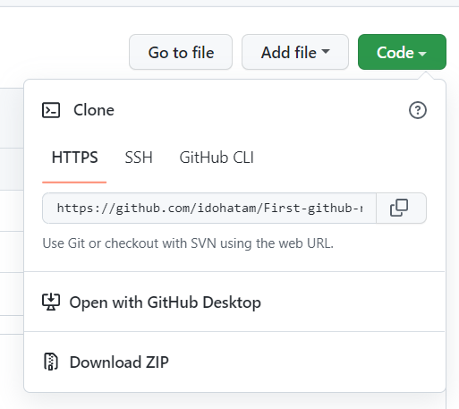
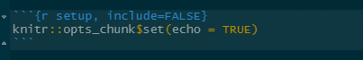

# **Introduction**

Welcome to your first Biol4315 lab. In this lab, you will:

- Set up your computational environment for the rest of the semester.
- Learn how to use R Markdown to create reproducible reports.
- Set up version control for your project using Git and GitHub.
- Learn how to pull and use Docker containers for reproducible bioinformatics workflows.
- Begin building your own personal project repo that you'll use throughout the term.

This lab is foundational to the rest of this course, and while it is a bit technical, it will equip you with tools you'll use *every single week*. Let’s get started.

---

# **Computational environment setup**

::: {.callout-note}
**Goal:** Configure your lab computer and install required tools using the course R package.
:::

1. Select your lab computer and start RStudio — You will use this same machine throughout the course so make sure to note wher you sit.

2. Visit the computational environment package [repository](https://github.com/idohatam/Biol4315setup)

3. Follow the tutorial on the GitHub README page - 
   This will:
   - Install the computational environment R package 
   - Install `Miniconda` (if not already installed)
   - Install essential third-party tools for upcoming labs
   - Install required R packages

Once the R package is installed set up your computational environment by running:

```{r}
#| label: env_setup
#| eval: false
conda_whats_installed()
```

This is the only function you need to run to complete the setup.

## **Setting up conda virtual environments**

Now that `conda` is installed, it can be used to install tools within virtual environments.
Using a virtual environment provides a clean, isolated space to install and manage bioinformatics tools without interfering with 
your system-wide packages or other projects. This makes your workflow more reproducible and avoids potential conflicts between 
software dependencies. The repo includes instruction for the installation of the long read genome assembler `flye`, due to some 
conflicts in `python` versions for different dependencies we will install it in a `conda` virtual environment with a less recent 
`python` version. Follow the tutorial in the repo and install `flye` on your computer. Make sure that the installation is successful as you will use `flye` for your final course project.

Next setup a `conda` environment called `sequali_env`, and install the QC tool `squali` in it. That's a QC tool for output from sequencers and you will use it in your next lab.   

---

# **Git & GitHub setup**

## **Setting up a github account and connecting it to your computer git cliante**

::: {.callout-note}
**Goal:** Set up a GitHub account and connect it to your local git client.
:::

The `Git` and `GitHub` component will follow a few parts from the book [Happy Git and GitHub for the R user](https://happygitwithr.com/index.html). The book is a great resource and I suggest you follow it if you wish to gain a deeper 
understanding of version control. 

1. If you haven’t already, create a `GitHub` account and sign-in to it.
I suggest following the guidelines for user name proposed in [chapter 4 of Happy Git](https://happygitwithr.com/github-acct.html)

2. Configure Git on your computer with your `GitHub` username and email:
Your lab computer should have git installed, you can test that the installation works by running the following code in the terminal (or in RStudio's terminal tab)

```{bash}
#| label: check git
#| eval: false
git -h
```

3. Next lets configure `git` with your `GitHub` username and email.

::: {.callout-important}
**Note that it is important that you use the same email you used for your GitHub account**
:::

```{bash}
#| label: firstgit
#| eval: false
git config --global user.name 'GitHub username'
git config --global user.email 'your_email@email.com'

#this will check if your account has been set
git config --global --list
```


## **Connecting git and GitHub to RStudio using a GitHub first approach**

::: {.callout-note}
**Goal:** Connect RStudio to GitHub and practice collaborative version control.
:::

1. On your `GitHub` page start a repo call it Biol4315_funzis_repo_your_initials.

2. Set up an HTTPS authentication token by runnig the following code chunk which will open up the relevant page on github
   - Make sure that "repo", "user", and "workflow" are selected (should be pre-selected when you run the code)
   - Set the expiration time for this token to at least 90 days.
   - Click submit and generate a token. Once the token is generated, copy it.
  
```{r}
#| label: token generation
#| eval: false
#| message: false
#| warning: false
usethis::create_github_token()
```

3. Run the following code it will prompt you to supply a password or a token, paste your token when prompt.
   
   - This will make sure that RStudio can access your `GitHub` repo
   

```{r}
#| label: cred
#| eval: false
#| message: false
#| warning: false
gitcreds::gitcreds_set()
```

4. Clone your GitHub repo using RStudio, cloning is copying the repo to your computer so you can work on it 
locally.

   - Copy your repo's URL (see image)
   
   - Follow the code chunk to connect `git` and `GitHub` to RStudio
   
{width=40% fig-align="center"}

```{r}
#| label: cloneR
#| eval: false
#| message: false
#| warning: false
usethis::create_from_github(
  "https://github.com/YOU/YOUR_REPO.git",
  destdir = "~/path/to/where/you/want/the/local/repo/")
```

5. Look at the file tab for a `readme.md` file, if present you're done

6. Note that you are now working on an RStudio project that has the same name as your `GitHub` repo.

## **First commits**

Commits are changes to your project you are ready to be archived by `git` and pushed to `GitHub`, this is the core of version 
control. Commits allow you to track changes to your your project and code, and commit comments allow you to archive and track the 
reason for each change.  

1. Open the `readme.md` file and add the line "This is a line I added via RStudio" to the readme file and save it. 

2. Open the git tab stage the change by checking the box next to the `readme.md` file and press commit. Make a descriptive comment.

3. Start a new R script file, save it as `practice.R` stage and commit it.

4. Push the commits to `GitHub` by pressing the push buttun on the git tab. 

5. Refresh your `GitHub` page to make sure it is up to date.

## **First colab**

`GitHub` allows you to collaborate on different projects while making sure changes are traked and reversible. 
One way to collaborate on a project you're interested in, is to fork it over to your `GitHub` page, make changes and suggest them 
to the owner of the repo you forked. Those are called pull requests. 
Here's how to do it:

1. Swap GitHub usernames with a partner.

2. From their `GitHub` page Fork your partner’s funzis_repo to yours.

3. Clone the forked repo so you can work on it locally (now that you know how to)

4. Add a small markdown file (`hello.md`) to their repo.

5. Get chatGPT to write a haiku and paste it to `hello.md`. 

6. Stage, commit and push your changes to your repo. 

7. From your `GitHub` page submit a pull request back to them.

8. Review and accept your partner’s pull request.

That's it, you've just successfully collaborated on a project.

---

# **Using RMarkdown for documentation, reports, and reproducible workflows**

::: {.callout-note}
**Goal:** Create your first `.Rmd` document, understand the structure, render it, and begin using it as your scientific notebook for this course.
:::

## **Why RMarkdown**

R Markdown allows you to combine code, output, and narrative in a single, shareable file. 
This format is the foundation of reproducible data science and will serve as your primary platform for documenting your lab work, 
results, and reflections throughout the course. You'll use it to generate reports, keep your notes organized, and track the 
evolution of your genome project.


## **Starting a RMarkdown document**

1. Get back to your own lab RStudio project

2. Load the `rmarkdown` and `knitr` packages

```{r}
#| label: loading them libraries
#| eval: false
#| results: hide

library(rmarkdown)
library(knitr)
```

3. Go to `File -> New File -> R Markdown...` name the title `Biol4315 Lab-1 Report`, and keep the format as html

4. Inspect the document, at the top you will find a `YAML` header which holds the document meta-data such as title, author, and output format.

{width=80% fig-align="center"}

5. Inspect the rest of the document note the code chunks and text chunks note the `##` which indicates a secondary title.

{width=80% fig-align="center"}

6. Save the file, name it `Biol4315_lab1_report_your_initials.RMD`, stage and commit the new file.

7. Render the `.Rmd` file by pressing Knit. Rendering runs all evaluated code chunks, since your code is documented in chunks the self contained document makes the output reproducible. 

8. Inspect the html output.

## **Modifying your document**

1. Add a primary title above the first secondary title with the name of the partner who's `GitHub` repo you forked.

2. Below the last line of template add the following:

   - A code chunk that isn't evaluated or ran when the document is rendered that installs the `vegan` package
   
   - A Text chunk that explain that your going to load the `ggplot2` package and plot a scatter plot of speed vs dist from the cars dataset
   
   - A code chunk that loads the `ggplot2` package and plots the scatter plot
   
3. Save, stage, commit, and push changes.

---

# **Using containerized environments with Docker desktop**

::: {.callout-note}
**Goal:** Understand what Docker is and how to run bioinformatics tools in isolated, reproducible environments.
:::

## **What are Docker and containerized environments?**

Docker is a tool that allows us to package software — including all of its dependencies — into containers that can run reliably on 
any system. In bioinformatics, this is particularly useful because many tools have complex installation requirements or conflict 
with one another. By using Docker containers, we avoid those issues and ensure both that usability, since there is no need to install anything, and reproducibility.

## **Why Docker in this course?**

In your genome assembly project, you’ll be using tools that are often deployed as containers to avoid conflicts. Furthermore, when using systems were you don't have admin privileges such as the computer clusters of the Digital Research Alliance of Canada, Docker containers circumvent the need to install software allowing you to conduct your work safely. Learning Docker now means you’ll be ready to run genomics tools like `BUSCO`, `Funannotate`, and more later in the semester.

## **Basic Docker commands**

::: {.callout-important}
**Note: For this part, make sure that docker desktop is running. If not, select it from the application launcher.**
**If the application is running yet the terminal doesn't recognize docker as a command, you will need to set the path to docker manually using the following code**

```{bash}
#| eval: false
#| label: docker_path

echo 'export PATH="$HOME/.docker/bin:$PATH"' >> ~/.zshenv
source ~/.zshenv
```

**After running this code make sure to restart the terminal window.**
:::

1. Open a terminal or shell in RStudio or your system

2. Pull the BUSCO image:

```{bash}
#| label: BUSCO1
#| eval: false
docker pull ezlabgva/busco
```

3. Check that it works by running:

```{bash}
#| label: BUSCO2
#| eval: false
docker run --rm --platform linux/amd64 ezlabgva/busco busco -h
```

The `run` command is intended for a non-interactive run where the order of operation is supplied in advance.

The `--rm` flag tells docker to remove the container upon exit so it doesn't stay in the background.

The `busco` argument tells the `run` function to run a containerized image of `busco`.

The `-h` flag tells `busco` to display the help menu.

The `--platform linux/amd64` makes sure that the linux version is compatible with apple silicon.

You should see the help menu, which confirms it installed correctly.

4. In your `.Rmd` file, include an un-evaluated code chunk that shows that pulls the funannotate image from docker hub, you might need to search funannotate to find the proper link.

5. Going back to the conda environments, include an un-evaluated code chunk for the installation of `squali` with conda you did earlier

6. Make sure to save, stage, commit, and push your changes to the `.Rmd` file.

---

# **Lab 1 assignment**

1. Make sure your `GitHub` repo is set.

2. Make sure all modification to your `.Rmd` are pushed to `GitHub`.

3. Email a link to your repo to your Lab instructor. 

---

# **Coming next week**

Next week, we’ll begin learning about sequencing data and how to assess the quality of both short- and long-read files. Be sure your `GitHub` repo is clean and working—you’ll be adding to it regularly!